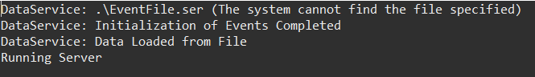
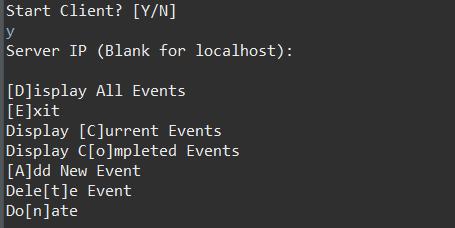
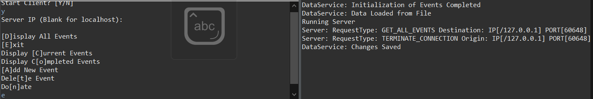

## INSTRUCTIONS
To run this project you have to import the project into an IDE and build it. Then you need to start the server by running Server.java. On initial startup the server will check for the serialized file containing all the events and if it doesn't exist the server will create it and save it. 
Now the server will wait for a connection from a client. To run a client, go into Client.java and run. Upon startup enter 'y' to run the client. Enter the IP address of the server (or nothing for a local instance) then enter what you want to do according to the menu options.  Upon fullfilling 5 requests the server will automatically save changes. Additionally, when a client decides to disconnect the server saves changes as well. 
(As a small note, selections of menu options are meant to be single characters, but any string starting with the appropriate character will work).

## ABOUT
This project is for CSCI 455 - Networking and Parallel Computation. It demostrates how to do smoe basic networking using java sockets as well as concurrency and data integrity when there are multiple clients accessing shared resources. This project uses very basic locks to achieve mutual exclusion of shared resources.
Overall the architecture and the sophistication of the threading and management of shared resources could be improved with more refinement.